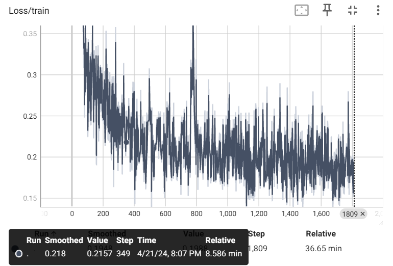

# environment
OS == linux  
python==3.10.5

`pip isntall -r requiremnets.txt`

# usage

`train.py --lr [lr] --epoch [epoch] --batch_size [batch_size] --val_ratio [val_ratio] --alpha [alpha] --k [k] --seed [seed] --dir [dir] --log_path [log_path]`

# 실험 보고

-data의 경우 3000여개의 traj_path 중 500개의 data로 train을 진행하였습니다.  
-가용 gpu가 없어 학습은 colab v100환경에서 진행하였습니다. 

  
hyper_parameter들은 다음과 같습니다.  
`lr = 1e-4`  
`epoch = 30`  
`batch_size = 64`  
`val_ratio=0.2`  
`alpha = 1e-4`  
`k = 10`  
`seed = 42`  

-학습 그래프를 확인한 결과 학습 초반에 빠르게 수렴하므로 learning_rate를 줄여야 좋은 결과가 나올 거 같습니다.  

